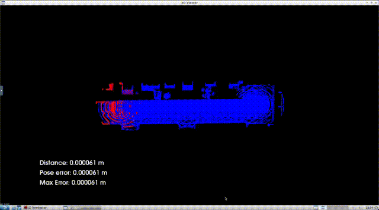
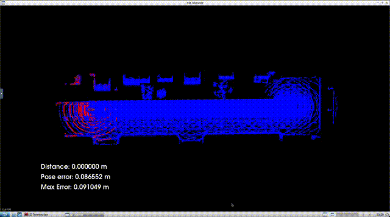

# udacity_nd013_c3_localization

## Implementation

NDT and ICP implementation were taken from lesson 6, and added to the `helper.cpp` file, along with their associated prototypes in `helper.h`.

The `c3-main.cpp` file is modified to add in both NDT and ICP implementations, get the current vehicle pose (using the method from lesson 6), and display the localization data in carla. The relevant section is copied below.

```
        if(!new_scan){ 
			new_scan = true;
			// TODO: (Filter scan using voxel filter)
			// Lesson 6 Part 7 - Create the Voxel Filter
            pcl::VoxelGrid<PointT> vg;
            vg.setInputCloud(scanCloud);
            double filterRes = 0.5;
			vg.setLeafSize(filterRes, filterRes, filterRes);
          	typename pcl::PointCloud<PointT>::Ptr cloudFiltered (new pcl::PointCloud<PointT>);
			vg.filter(*cloudFiltered);
			// TODO: Find pose transform by using ICP or NDT matching
			//pose = ....
            // Lesson 6 part 17
            pose = Pose(Point(vehicle->GetTransform().location.x, 
                              vehicle->GetTransform().location.y, 
                              vehicle->GetTransform().location.z), 
                        Rotate(vehicle->GetTransform().rotation.yaw * pi/180, 
                               vehicle->GetTransform().rotation.pitch * pi/180, 
                               vehicle->GetTransform().rotation.roll * pi/180)) - poseRef;
            // Using ICP
            // Lesson 6 Part 7
            Eigen::Matrix4d transform = ICP(mapCloud, cloudFiltered, pose, 0);
            // Using NDT
            // Lesson 6 Part 12
            pcl::NormalDistributionsTransform<pcl::PointXYZ, pcl::PointXYZ> ndt;
			ndt.setTransformationEpsilon (.0001);
			ndt.setStepSize (1);
			ndt.setResolution (1);
			ndt.setInputTarget (mapCloud);
            // Eigen::Matrix4d transform = NDT(ndt, cloudFiltered, pose, 0);
          
            pose = getPose(transform);
            // TODO: Transform scan so it aligns with ego's actual pose and render that scan
			PointCloudT::Ptr newCloud(new PointCloudT);
            pcl::transformPointCloud(*cloudFiltered, *newCloud, transform);
			viewer->removePointCloud("scan");
			// TODO: Change `scanCloud` below to your transformed scan
			renderPointCloud(viewer, newCloud, "scan", Color(1,0,0) );
```
            
## Results

Below are three screen captures showing the results in Carla, first the baseline, then NDT and ICP. ICP showed the best performance, in this case.

The code is currently setup to run ICP.

### Baseline 



### NDT



### ICP

